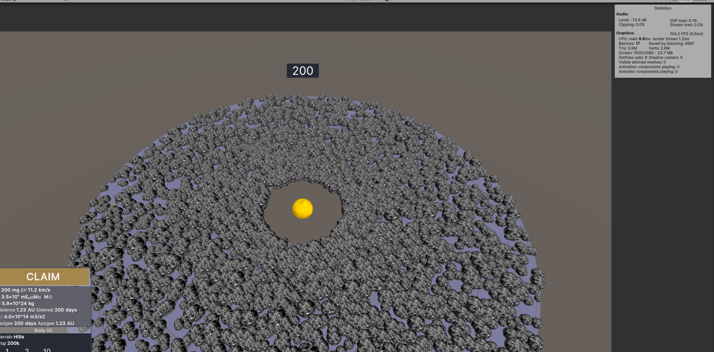

# Bottlenecks 
This file contains list of bottlenecks, right now its a bit unstructured, but with the primary use of this document to actually document the changes.

# Know issues
Using Unity Profiler with deep mode enabled can give 4x worse performance.  
Look into using profilemarkers instead.

# Known bottlenecks

## Rendering planets

### Orbits 0.1
5k planets. No UI, 15 ms  
Timings: Update 5.71, Orbits 5.46, Bodies 0.13  
In orbits 3.00 - 5.00 GetOrbitMatricies 0.92 Rendermesh  
Changing to RenderMeshInstanced got it down to 0.01 ms  
Changing to Burst method with caching the rotation goes to 0.17 and without caching 0.40.   
Now orbits are only 0.25 ms from 5.50 ms that is approx 20x speedup
