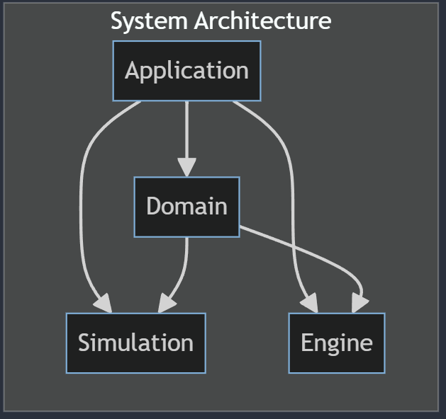
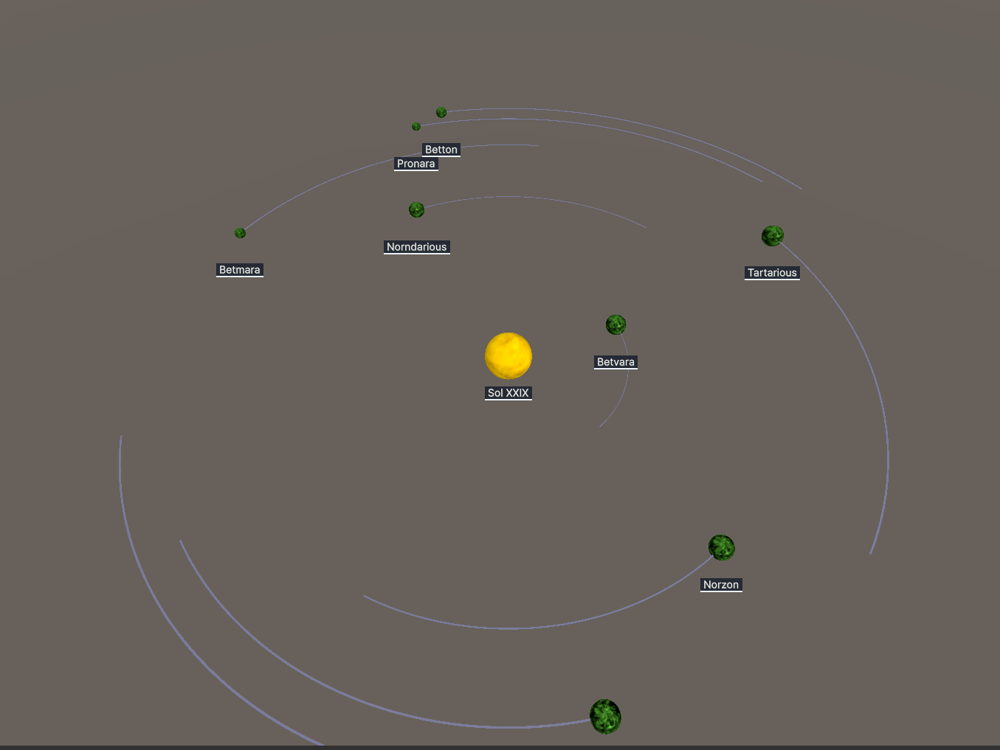

# What is this
This is a simulation of planets using DOTS ECS Unity UI Toolkit and graphicsbuffers.
# Features
The game is a tickbased planet simulator where each planet gains point every tick.
- Solar System
- Input system
- Fast rendering using indirect rendering
- UI systems using Unity Toolkit
- Calculated with Unity DOTS ECS
- Benchmark tests, that will measure performance of methods and application.

# Architecture
This section describes the Projects in this system and how they interact with each other.
Each project is found in the Assets/scripts folder.

The **Application** handles all end user interactions to the domain and rendering of domain objects, interacts with all the other.

The **Domain** handles all domain related logic  

The **Simulation** contains mathematical complex formulas and equations used in the domain. Such as calculation of planetary gravity and position on an elipse.

The **Engine** shares commonly used tools that are not domain specific. Such as a physics raycast. Rendering helper scripts. And system groups like time systems for ticks

## Other projects
The **Benchmark.Test** contains performance tests of methods and applications, so the method of recording is streamlined between iterations, and performance of the application can be compared.

## Engine
- Physics spherecollider
- Fast rendering

## Gameplay
- Discovery systen
- Solar system

Looks like this 

## Rendering
Custom fast rendering shaders 
- A shader for Position using using buffers
- A shader for Position and animation using buffers
- A rendering system using UI Toolkit both for world and screenspace

## Simulation
- Orbitalmechanics, math related to calculating properties like the year for a given planet  
- Ellipsemechanics, math related to ellipse 
- Circlemechanics, math releated to circles

